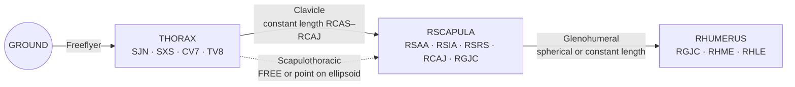
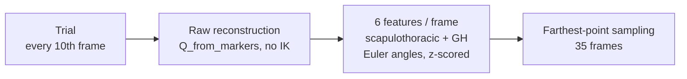
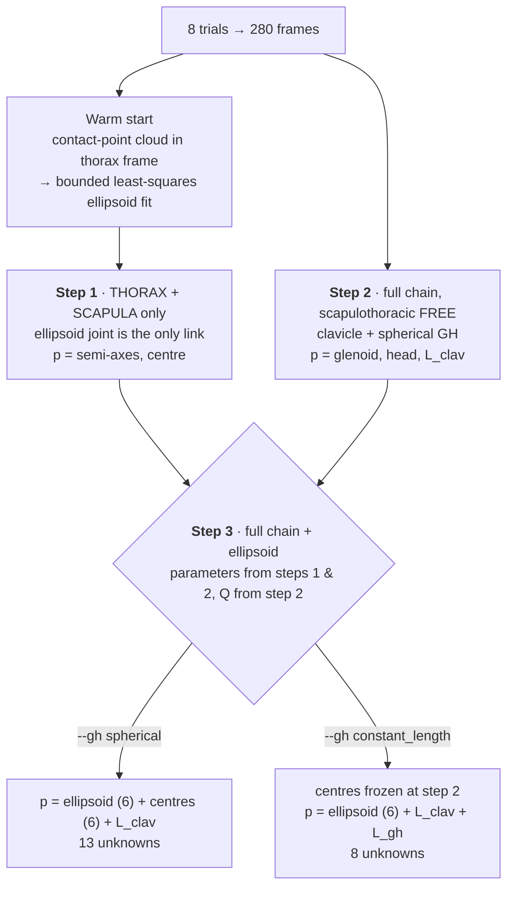
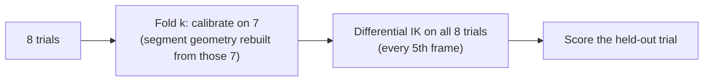

# Shoulder kinematic calibration

Subject-specific calibration of the thorax–scapula–humerus chain from a whole motion-capture session.
Code: [`studies/shoulder_calibration.py`](../studies/shoulder_calibration.py) (pipeline),
[`studies/kinematic_calibration.py`](../studies/kinematic_calibration.py) (NLP),
[`studies/shoulder_calibration_loo.py`](../studies/shoulder_calibration_loo.py) (validation).

## 1. Goal

Some parameters of the shoulder chain cannot be identified from a single trial:

- the **thoracic ellipsoid** the scapula glides on (semi-axes and centre),
- the **clavicle length**,
- the **glenohumeral (GH) centre**, one estimate in each bone.

They are estimated **once, from all the trials at once**. Two questions follow:
does the calibration **generalise** to unseen trials, and is a **spherical** GH joint better than a
**constant-length** one?

## 2. Data and model

- Session `99007140`, 8 trials: `ANALYTIC1–4`, `FUNCTIONAL1–4`. Anatomical marker set (bony
  landmarks are the tracked markers).
- Model: `bionc`, natural coordinates. Each segment has
  $Q_s = [u,\ r_p,\ r_d,\ w] \in \mathbb{R}^{12}$, so 36 unknowns per frame for 3 segments.



**Joint constraints** $\Phi^k$ (one row per equation):

| Joint | Constraint | Eq. |
|---|---|---|
| Clavicle | $\lVert P_{RCAS} - P_{RCAJ}\rVert^2 - L_{clav}^2 = 0$ | 1 |
| Scapulothoracic ellipsoid | $\sum_{i=1}^{3} \dfrac{\big(a_i \cdot (P - C)\big)^2}{s_i^2} - 1 = 0$ | 1 |
| GH spherical | $P_{g} - P_{h} = 0$ | 3 |
| GH constant length | $\lVert P_{g} - P_{h}\rVert^2 - L_{gh}^2 = 0$ | 1 |

- **Ellipsoid**: $P$ is the centroid of RSAA/RSIA/RSRS, and $(C,\ a_i,\ s_i)$ are the centre, principal axes and
  semi-axes, all attached to the thorax.
- **GH centres**: $P_g$ and $P_h$ are **dedicated, non-tracked** points: `GH_GLENOID` on the scapula and
  `GH_HEAD` on the humerus, both initialised at the lab's `RGJC`. `RGJC` itself stays a tracked marker, so the
  marker term keeps pulling on it while the joint centre moves.

## 3. Frame selection

**Problem.** The session has 25 312 frames; one NLP affords a few hundred. A uniform stride samples *time*:
slow sweeps and holds give near-duplicate postures, which add cost but no information.

**Idea.** Sample the *posture space* instead, per trial:



**Farthest-point sampling.**

1. Start from the frame farthest from the trial's mean posture.
2. Repeatedly add the frame whose distance to its nearest already-picked frame is largest.

This is deterministic, and every pick fills the largest remaining gap.

**Budget: 35 frames per trial, 280 in total** (245 per validation fold). "Coverage radius" is the distance from
the worst-covered posture to its nearest selected frame (lower is better):

| Frames per trial | Farthest-point | Uniform stride |
|---|---|---|
| 20 | 1.02 | 2.16 |
| **35** | **0.72** | 1.49 |
| 80 | 0.40 | 1.04 |

The curve flattens around 25–35 frames. Farthest-point sampling at 20 frames matches a uniform stride at 80.

## 4. The optimisation problem

All frames and all shared parameters are solved in **one** NLP. The unknowns are the natural coordinates of every frame
$\{Q_f\}_{f=1}^{F}$ and the parameter vector $p = [p_1, \dots, p_B]$.

$$
\begin{aligned}
\min_{\{Q_f\},\ p}\quad & \sum_{f=1}^{F} \tfrac12 \big\lVert \Phi^m(Q_f, p) - x_f \big\rVert^2
\;+\; \lambda \sum_{b=1}^{B} w_b \,\big\lVert p_b - p_b^{0} \big\rVert^2 \\[2pt]
\text{s.t.}\quad & \Phi^r(Q_f) = 0 && \text{rigid body, } \forall f \\
& \Phi^k(Q_f, p) = 0 && \text{joints, } \forall f \\
& \det[u\ v\ w]_{s,f} \ge 0 && \text{direct frames, } \forall s, f \\
& p^{lb} \le p \le p^{ub}
\end{aligned}
$$

- **Marker term**: $\Phi^m$ are the model's technical markers and $x_f$ the measured ones.
- **Ridge** $\lambda \sum_b w_b \lVert p_b - p_b^0\rVert^2$:
  - $p_b^0$ is block $b$'s warm start.
  - $\lambda = 0.02\,F$, so the ridge scales with the marker term.
  - $w_b$ is set per block, so a well-identified parameter is never dragged by a poorly identified one.
- **Solver**: CasADi (MX), IPOPT with exact Hessian, tol $10^{-8}$. With $F = 280$ there are about 10 000
  unknowns. Frames couple only through $p$, so the problem is very sparse; step 3 solves in about 45 s.
- **Units**: positions are expressed in the segment's orthonormal frame, in metres, so bounds and ridges have a physical meaning.
- **Bound check**: a parameter within 1 % of a bound is **reported as "at bounds"**. Such a parameter is
  constrained, not calibrated.

**Parameter blocks**

| Block $p_b$ | Size | Box | $w_b$ |
|---|---|---|---|
| Ellipsoid semi-axes $(a,b,c)$ | 3 | $[0.6,\ 1.8] \times$ thorax size | 1 |
| Ellipsoid centre (thorax frame) | 3 | ±150 mm around the thorax box centre | 1 |
| Glenoid centre (scapula frame) | 3 | ±80 mm around warm start | 0.25 |
| Humeral-head centre (humerus frame) | 3 | ±80 mm around warm start | 0.25 |
| Clavicle length $L_{clav}$ | 1 | $[0.5,\ 1.5] \times$ warm start | 0 |
| GH length $L_{gh}$ (constant-length model only) | 1 | $[1,\ 50]$ mm | 0 |

"Thorax size" is the largest half-extent of SJN/SXS/CV7/TV8 in the thorax frame, so every ellipsoid bound
scales with the subject.

## 5. Procedure: three steps



| Step | Why this way |
|---|---|
| **Warm start** | The ellipsoid is fitted by radial surface distance. A free quadric fit on a small patch returns hyperboloids and inflates the scale. |
| **1** | Without clavicle or humerus, nothing else can absorb the ellipsoid residual, so the data has to explain it. |
| **2** | A SCoRE-style functional joint-centre estimate, written as a constrained IK. Leaving the scapulothoracic joint free keeps ellipsoid errors out of the centres. |
| **3** | Closes the loop and re-solves everything jointly. How far step 3 moves the step 1/2 answers is reported. |

Steps 1 and 2 are **identical in both GH models**, so the two runs differ in one thing only.

## 6. Identifiability: what shaped the design

**(a) GH length and GH centres cannot be calibrated together.**
Suppose $(c_g, c_h, 0)$ fits. Then $(c_g,\ c_h + d,\ \lVert d \rVert)$ fits equally well for *any* $d$, because
$\lVert P_g - P_h \rVert = \lVert R_h d \rVert$ is constant. Hence:

- **Spherical model**: calibrate the centres; there is no length to calibrate.
- **Constant-length model**: freeze the centres at step 2 and calibrate $L_{gh}$. The warm start is the mean centre
  separation on an **all-FREE** reconstruction. On step 2's own $Q$ that separation is 0 by construction.
- $L_{gh} = 0$ would be **singular**: the Jacobian $2(P_g - P_h)^\top N$ vanishes. Hence the 1 mm floor, and
  the constant-length joint is never built on the shared `RGJC` marker.

**(b) A contact patch does not determine an ellipsoid.**
The scapula sweeps about 55 × 52 × 67 mm. Over that patch, the best-fit surface residual changes by **0.05 mm** when
the radius goes from 80 to 300 mm, against a **5.1 mm** noise floor. The semi-axes are therefore held near thorax size by the
explicit ridge, and the across-fold spread of the semi-axes mostly reflects that prior.

**(c) One direction of the GH centre is flat.** Moving the glenoid 63 mm changes RMSE by 0.01 mm. This is
why both centres get a light ridge ($w_b = 0.25$).

## 7. Validation: leave-one-trial-out



Each held-out trial is reconstructed **four ways**, which separates two opposite effects:
calibration should improve the fit, while adding the ellipsoid removes a DoF and can only worsen it.

| Reconstruction | Meaning |
|---|---|
| all-FREE | achievable floor, and the unbiased yardstick for the geometry |
| uncalibrated | clavicle + spherical GH on lab `RGJC`, nothing calibrated |
| step 2 | calibrated centres and clavicle, scapulothoracic free |
| step 3 | + calibrated ellipsoid |

Also measured out of sample:

- the **GH centre gap**: distance between the two calibrated centres on the all-FREE reconstruction;
- the **ellipsoid surface distance** of the held-out contact point.

## 8. Results (held-out trial, mean ± SD over 8 folds)

| Held-out metric | Spherical GH | Constant-length GH |
|---|---|---|
| Marker RMSE, all-FREE floor | 4.41 ± 0.76 mm | 4.41 ± 0.76 mm |
| Marker RMSE, uncalibrated | 5.97 ± 1.12 mm | 5.97 ± 1.12 mm |
| Marker RMSE, step 2 | 5.55 ± 1.06 mm | 5.55 ± 1.06 mm |
| **Marker RMSE, step 3** | **6.50 ± 1.01 mm** | **6.15 ± 0.89 mm** |
| GH distance imposed by the joint | 0 mm | **6.76 ± 0.28 mm** |
| GH centre gap observed (FREE recon.) | 6.08 ± 1.79 mm | 5.83 ± 1.58 mm |
| Ellipsoid surface RMS | 6.06 ± 2.81 mm | 6.05 ± 2.79 mm |
| Clavicle length | 151.2 ± 0.6 mm | 150.9 ± 0.6 mm |

Semi-axes are about 155 / 144 / 162 mm (SD 2–4 mm, held by the ridge). **No parameter reached a bound** in any fold, in either model.

**Take-aways**

1. **Calibration alone helps out of sample**: step 2 is 0.42 mm below the uncalibrated model.
2. **The ellipsoid has a price**: +0.95 mm (spherical) and +0.60 mm (constant length) over step 2.
3. **Constant-length GH beats spherical by 0.35 mm** on unseen trials, on all 8 folds. The gain is almost entirely on
   the humerus markers (−1.55 mm), versus −0.16 mm for the thorax and −0.14 mm for the scapula.
4. **The calibrated GH radius (6.8 mm) matches the separation observed on unseen trials (5.8 mm)**. The prior
   constrains neither number, so this is genuine out-of-sample agreement.
5. **The ellipsoid transfers only loosely**: the signed surface bias changes sign across folds (−7.7 to +8.2 mm),
   about the size of the contact point's own scatter.

Figures: `results/figures/` (spherical) and `results_gh_constant/figures/` (constant length).
`gh_comparison.png` shows both models side by side.

## 9. Limits and open questions

- **One subject**: all numbers come from a single session.
- **Ellipsoid curvature** is set by the ridge, not by the data (§6b). The surface near the contact patch is
  what the data actually constrains.
- **Constant-length centres are frozen** at the spherical step-2 answer. Re-estimating centres and radius
  together would need extra information, e.g. a humeral-head translation prior or imaging.
- **Anatomical markers only**: the skin-cluster marker set is not calibrated here.
- **The 6.8 mm translation**: real humeral-head translation, or soft-tissue artefact absorbed by the joint? Still open.

## 10. Reproduce

Run inside the `bionc` conda environment, with the sibling `bioNC` checkout on `PYTHONPATH`:

```bash
python studies/shoulder_calibration.py         --gh constant_length   # one calibration, a few minutes
python studies/shoulder_calibration_loo.py     --gh constant_length   # 8 folds, ~35 min, cached
python studies/figures/calibration_steps.py    --gh constant_length --save
python studies/figures/leave_one_out.py        --gh constant_length --save
python studies/figures/gh_comparison.py        --save                 # needs both sweeps
```

Leave out `--gh` (default `spherical`) to produce the `results/` tree.
